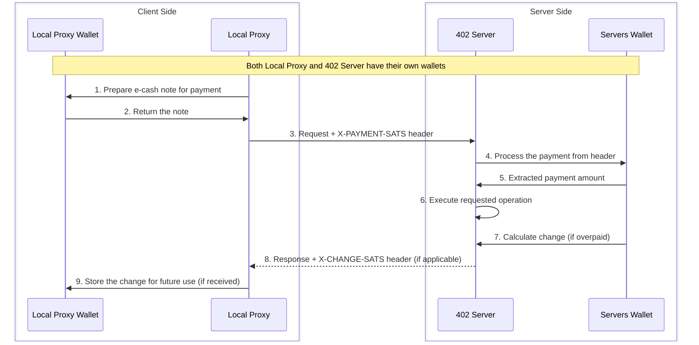
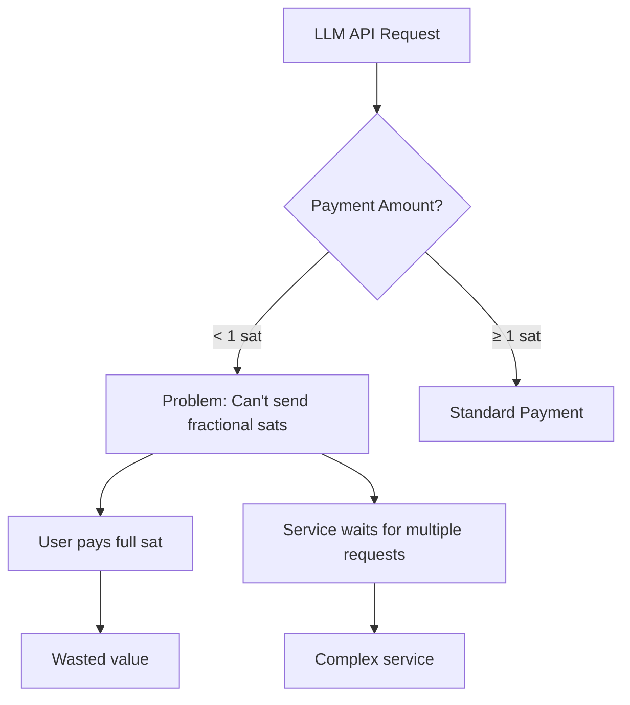
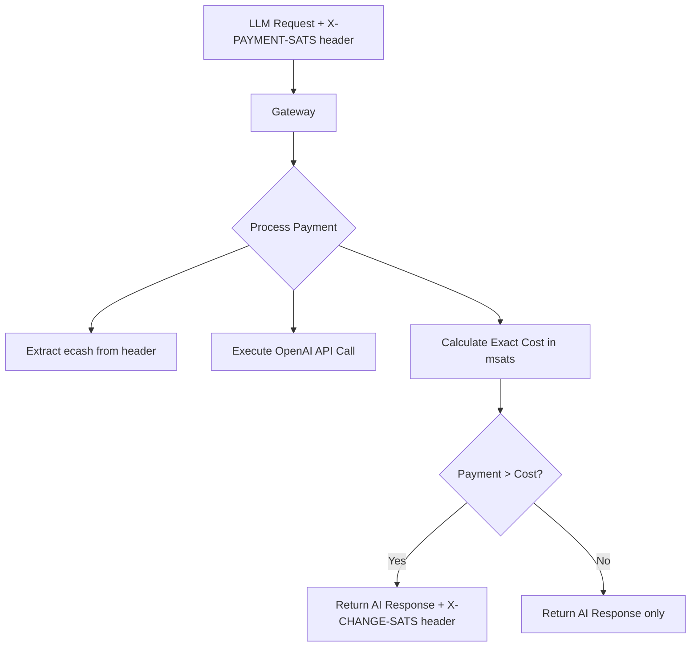
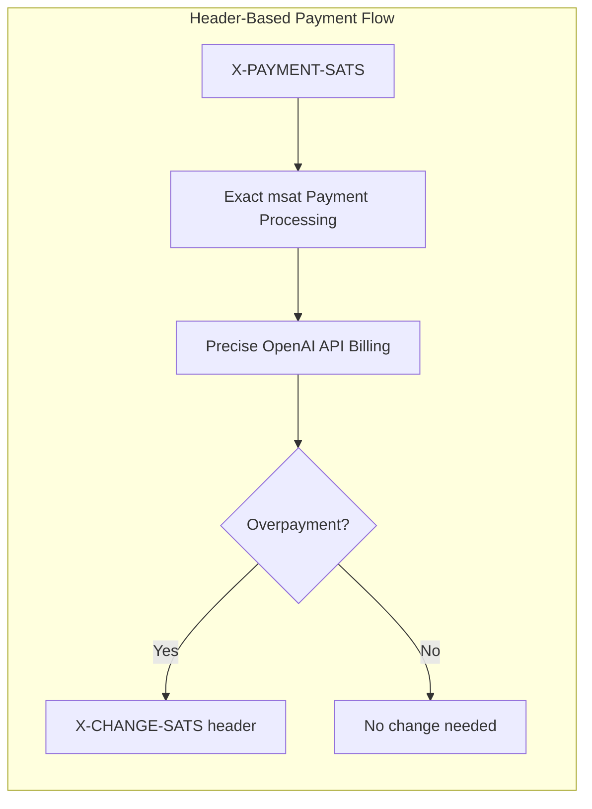

⚠️ **Don't be reckless:** This project is in early development, it does however work with real sats! Always use amounts you don't mind loosing.

**⚠️ IMPORTANT NOTE**: This README describes the project's end goal and vision. The current implementation is in early development, experimental, and not yet stable for production use. Features described here represent the intended functionality which is still being actively developed.

**Millisatoshi Precision Support** - Both server and client now support millisatoshi (msat) micropayments for ultra-precise billing! No more rounding errors or overpayment waste - pay exactly what you consume down to the millisatoshi level.

# Wallet Gateway

A privacy-focused payment gateway that enables anonymous micropayments using e-cash notes (also known as Cashu notes) for accessing Large Language Models via the OpenAI API.

## Project Overview

Wallet Gateway is a privacy-focused payment gateway that enables anonymous micropayments using e-cash notes (also known as Cashu notes) for accessing Large Language Models via the OpenAI API. On the client side, it provides a Local Proxy that manages these notes using the Local Proxy Wallet. The Local Proxy modifies API requests to include the notes. On the server side, the 402 Server acts as a wrapper around the OpenAI API, handling note redemption, payment processing, and change generation with the help of the Server's Wallet.

### Key Features

- **Anonymous AI Access**: Access OpenAI's language models without revealing your identity
- **Change Management**: Returns unused funds through a Cashu note-based approach
- **Fee Handling**: Options to manage mint fees through change notes or private fee-free mints
- **API Compatibility**: Seamlessly works with standard OpenAI API endpoints

## How It Works

The diagram below illustrates the interaction between client and server components, each with their own wallet:



In this workflow:

1. The Local Proxy prepares a payment using the Local Proxy Wallet for an OpenAI API request
2. The Local Proxy Wallet provides a valid e-cash note
3. The Local Proxy sends the LLM request with the note in the `X-PAYMENT-SATS` header to the 402 Server
4. The 402 Server extracts the payment from the header and passes it to the Server's Wallet for processing
5. The Server's Wallet informs the 402 Server of the available amount
6. The 402 Server forwards the request to OpenAI and processes the AI model response
7. The Server's Wallet calculates change if the payment exceeds the actual usage
8. The 402 Server sends the OpenAI response with change in the `X-CHANGE-SATS` header (only if overpaid)
9. The Local Proxy stores the change in the Local Proxy Wallet for future LLM requests (if change was provided)

This approach maintains privacy while efficiently handling micropayments for AI services. The 402 Server extracts the exact amount needed from the `X-PAYMENT-SATS` header for the specific OpenAI API call and returns any remainder via the `X-CHANGE-SATS` header only when overpayment occurs.

## The Micropayment Challenge for AI Services

The Bitcoin network's limitation of 1 satoshi as the smallest transaction unit creates challenges for micropayments in AI services. This constraint particularly affects high-volume, low-cost AI API calls where transaction amounts are often fractions of a satoshi.

The following flow chart visualizes how we intend to address the problem:



This flowchart illustrates the fundamental challenge with Bitcoin micropayments for AI services:

- When an OpenAI API call costs less than 1 satoshi, there's no native way to pay the exact amount
- Users must either overpay (wasting value) or the service must batch multiple LLM requests (more complexity)
- This inefficiency becomes significant for high-volume, low-cost AI API calls like embeddings or short completions

## Our Solution

Wallet Gateway addresses the micropayment challenge for AI services through an innovative approach using millisatoshi (msat) precision Cashu mints. This method enables exact payments for API calls without rounding errors or ceiling effects, ensuring users pay precisely for what they consume.

The system uses HTTP headers for seamless payment integration: clients send ecash notes via the `X-PAYMENT-SATS` header, and servers return change (when overpaid) via the `X-CHANGE-SATS` header.

Wallet Gateway addresses the micropayment challenge for AI services through this millisatoshi-based approach:





This flowchart shows our solution:

- Clients send ecash notes through the `X-PAYMENT-SATS` HTTP header for seamless integration
- The gateway processes payments using millisatoshi precision for exact billing
- Payments are calculated to exact millisatoshi amounts based on actual API usage
- Change is returned via `X-CHANGE-SATS` header only when the payment exceeds consumption
- This enables true micropayments for AI services without rounding errors or overpayment waste

## Fee Management Options

There are two approaches to handling mint fees:

1. **Change Cashu notes**: Return unused funds as Cashu notes for future use with AI services
2. **Private Fee-Free Mint**: Operate a private mint without fees

## Project Structure

- **Gateway**: API server handling Cashu note redemption and payment processing for OpenAI requests
- **Wallet**: Manages eCash (Cashu) notes and communication with mints
- **Pay**: Handles cost calculation and payment verification for AI model usage

### Cashu note Management Workflow

1. **Get initial Cashu note**: Obtain a Cashu note from a Cashu mint
2. **Make OpenAI API request**: Send the Cashu note in the `X-PAYMENT-SATS` header with your LLM API request
3. **Process response**: Receive the OpenAI response and check for `X-CHANGE-SATS` header
4. **Save change (if any)**: Store any returned change Cashu note from the `X-CHANGE-SATS` header
5. **Use for next request**: Use the change Cashu note in future `X-PAYMENT-SATS` headers for subsequent AI service requests

This approach allows for efficient micropayments for AI services. You only receive change when you overpay, preventing waste on small transactions.

## Getting Started

### Running the Client

```bash
# Run the client component
docker-compose up
```

or

```bash
# Run the client component
docker-compose up -d
```

to run in the background

The user interface can be accessed at http://localhost:3332.

### Using the Local OpenAI API Endpoint

Once the client is running, you can connect your OpenAI-compatible tools and editors to:

```
http://localhost:3333
```

**No API key is required when using this local endpoint**

### Current Cashu Mint
```
ecashmint.otrta.me
```

### Example API Request with Ecash Payment

Here's an example of how to make a request with ecash payment using curl:

```bash
curl -i -X POST https://ecash.otrta.me/v1/chat/completions \
  -H "Content-Type: application/json" \
  -H "X-PAYMENT-SATS: cashuAeyJ0b2tlbiI6W3sicHJvb2ZzIjpbeyJpZCI6IjAwOWExZjI5M2F..." \
  -d '{
    "model": "meta-llama/llama-4-scout-17b-16e-instruct",
    "messages": [
        {
            "role": "user",
            "content": "hello ecash"
        }
    ]
  }'
```

**Example Response Headers:**
```
...
X-CHANGE-SATS: cashuAeyJ0b2tlbiI6W3sicHJvb2ZzIjpbeyJpZCI6IjAwOWExZjI5M2F...
...

{
  "choices": [
    {
      "message": {
        "role": "assistant",
        "content": "Hello! I see you're using ecash for payment. How can I help you today?"
      }
    }
  ]
}
```

The `-i` flag ensures you see the response headers, including any `X-CHANGE-SATS` header with your change.

### Next step

- [ ] Multi Wallet support
- [x] Develop a Payment History feature to monitor ecash transactions
- [ ] Implement server/service provider discovery (possibly via Nostr)
- [x] Enhance handling of amounts under 1 sat
- [ ] Broaden the application of 402 payment for various scenarios

## Contributing

Contributions are welcome! Please feel free to submit a Pull Request.
